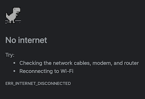

---

# "Getting Help in Python When Coding Offline"

### 2020-06-19 {#date}

### python, self-help, no-internet {#tags}

---

For most of the last year, I've written, studied and coded in offline mode. The following are some of my offline sources of reference.



### Browsers 

I love websites, such as [Chakra UI](https://chakra-ui.com/), that cache docs locally using local storage and service workers. I hope more documentation sites do this, particularly for tutorials.

[Dev Docs](https://devdocs.io/) allows you to cache different sets of documentation. I use it for HTML, CSS, DOM, Enzyme, HTTP, Javascript, Jest, Markdown, Matplotlib, Node, Pandas, Python, React and TypeScript. 


### Command Line

In most REPLs and command lines hitting the tab key will display the possible completions.

```python
>>> re.<tab key>
re.A            re.IGNORECASE   re.Match(       re.T    ...
```

`help` is a go-to in the Python REPL.

```python
>>> help(str.split)

Help on built-in function split:

split(sep=None, maxsplit=-1) method of builtins.str instance
    Return a list of the words in the string, using sep as the delimiter string. [...]
```

Also available in Python is `dir`. Given an object, such as `str` below, `dir` returns "some of" an object's attributes. Called without an argument it'll return the names in the current scope.

```python
>>> dir(str)

['__add__', '__class__', '__contains__', ... 'upper', 'zfill']
```

### Node Modules

One of the pleasures of coding offline is getting intimate with the packages one uses. In  libraries like [Gatsby](https://www.gatsbyjs.org/), I'll fork/clone the repo for offline reference. The repo for development will have more documentation and useful resources than the installed package. That said, I commonly find  interesting code in `node_modules` that I haven't read.

To read these I start with the read-me, in VS Code's markdown preview mode.

```
code node_modules/funcional-red-black-tree/README.md
``` 

