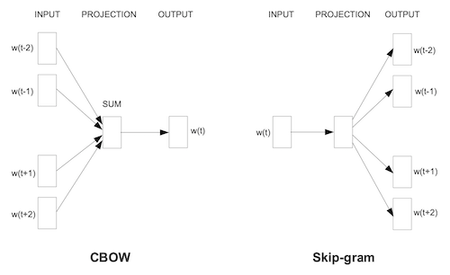

---
#  Can Word2Vec Describe Art-Historical Categories?
### 2020-07-04 {#date}
### word2vec, quackery, the-curator, art {#tags}
---

## Part One: Gathering Data 

Last year, after reading some papers on the subject, I got excited about [Word2Vec](https://arxiv.org/abs/1301.3781) and [GLoVE](https://nlp.stanford.edu/pubs/glove.pdf). Researchers were using large bodies of text — for example, from Google News and Wikipedia — to train models, which could predict the next word following a sequence of words, or describe analogies, such as "Paris is to France as Berlin is to `X`", where the model accurately predicts `X` is "Germany."<sup>1</sup> 



<Caption>An illustration from <a href="https://arxiv.org/abs/1301.3781">Efficient Estimation of Word Representations in Vector Space</a> showing the context windows for bag of words and skip-gram.</Caption>

I read that Word2Vec analyzes documents in two modes: bag-of-words and skip-gram. Both modes define a default context window of five words. In bag-of-words mode, the model starts with `[a, b, d, e]` and tries to predict `c`, while skip-gram goes in the opposite direction, taking `c` and trying to predict `[a, b, d, e]`. 

One way to look at this is that, within the context window, words are equally related. Take this sentence from Hamlet:

```python
'To be or not to be that is the question'
```

If we were to slide a context window across Shakespeare's ten famous words, they would be split into two groups of five words each<sup>2</sup>:

```python
# group A
['to', 'be', 'or', 'not', 'to']

# group B
['be', 'that', 'is', 'the', 'question']
```

<Caption>(Up### See footnote 2 for how this is an oversimplification of how the context window proceeds.)</Caption> {#date}

Since the terms within a context window are equally related, rearranging the order of those terms is arbitrary. So the following two groups are equal to the previous two.

```python
# group A
['be', 'not', 'or', 'to', 'to']

# group B
['question', 'the', 'is', 'that', 'be']
```

<Caption>(I'm simplifying a bit here. Words that appear often and words that appear seldemly are stripped from corpora because they impart less information — at least in the English language.)</Caption>

Therefore, the context window can be thought about as a complete graph, where each node connects to all the other nodes.


<Caption>A K5 complete graph.</Caption>

So while I was sliding context windows across sentences, I wondered, what if a corpus exploited the context window but wasn't a corpus of sequential sentences, or even sentences at all? What if it was a graph?

I can't pinpoint exactly what it is about network graphs that fascinate me, but they are one of my favorite structures. Is there a more elegant way to describe relationships between two or more things? Network graphs can map out everything from the [bridges of Königsberg](https://en.wikipedia.org/wiki/Seven_Bridges_of_K%C3%B6nigsberg) to associations between memories. If you love graphs, then you know what I'm talking about.

At some point I downloaded the [exhibition data](https://github.com/MuseumofModernArt/exhibitions) from the Museum of Modern Art (MoMA). Data is something else that fascinates me. Rationally, I know that most people don't share my fascination of huge datasets. But deep down, I don't understand how they could not. 

Naturally, a graph describes MoMA's exhibition data. Here is the exhibition titled "Five Unrelated Photographers", number `723`.


<Caption>If you were wondering, the number 723 is not a prime, and these five photographers are obviously related.</Caption>

Each exhibition points to its members, in this example five. From the point of view of the exhibition, each member is equally related. That is, we could also represent "Five Unrelated Photographers" as a K5 complete graph, which is the same graph as the context window. So this exhibition could also be represented in a context window!

```python
['kenheyman', 'georgekrause', 'jeromeliebling', 'minorwhite', 'garrywinogrand']
```

Because the count of artists is equal to the size of the context window, Word2Vec will recognize this as a group of equally related terms.

But what about exhibitions where the member count is greater than the size of the context window?

Python has a great standard module called `itertools`, which includes functions for `combinations` and `permutations`. For this purpose, the order of terms is arbitrary, so `combinations` is the function to use. Given an exhibition of N terms and an r-length equal to the size of the context window, combinations produces a list of all possible combinations. 

```python
>>> from itertools import combinations
>>> combos = combinations(range(6), 5)
>>> [x for x in combos]
[
    (0, 1, 2, 3, 4), 
    (0, 1, 2, 3, 5), 
    (0, 1, 2, 4, 5), 
    (0, 1, 3, 4, 5), 
    (0, 2, 3, 4, 5), 
    (1, 2, 3, 4, 5)
]
```

From this results the building blocks for a new dataset that can be fed into Word2Vec. A sample of the resulting dataset looks like this:

```txt
...
peggibacon paulgauloi charlgoeller arshilgorki annweaver
peggibacon paulgauloi charlgoeller stefanhirsch hokeah
peggibacon paulgauloi charlgoeller stefanhirsch ruthjona
...
```

The big question is, for now, left unanswered. Whether or not, the model can describe art historical movements and disprove the null hypothesis is the topic for future posts. But first, I need a way to visualize the model's results and to measure the error rate. 

* * * 

## Footnote

1. This is a great talk by [Rachel Thomas](https://www.youtube.com/watch?v=25nC0n9ERq4&t=1s), who explains word embeddings and also goes into the biases they can encode.

2. Up### This is an extreme simplification of how the context window proceeds. It actually iterates across a sentence word by word. {#date}

```
WORD     -->       WINDOW
----------------------------------
to       --> ['be', 'or', 'not']
be       --> ['to', 'or', 'not', 'to']
or       --> ['to', 'be', 'not', 'to', 'be']
not      --> ['to', 'be', 'or', 'to', 'be', 'that']
to       --> ['be', 'or', 'not', 'be', 'that', 'is']
be       --> ['or', 'not', 'to', 'that', 'is', 'the']
that     --> ['not', 'to', 'be', 'is', 'the', 'question']
is       --> ['to', 'be', 'that', 'the', 'question']
the      --> ['be', 'that', 'is', 'question']
question --> ['that', 'is', 'the']
```