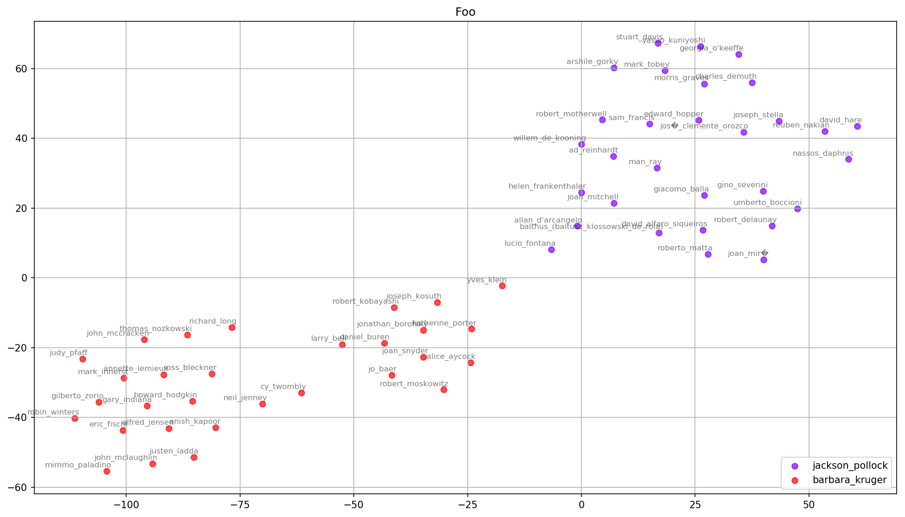
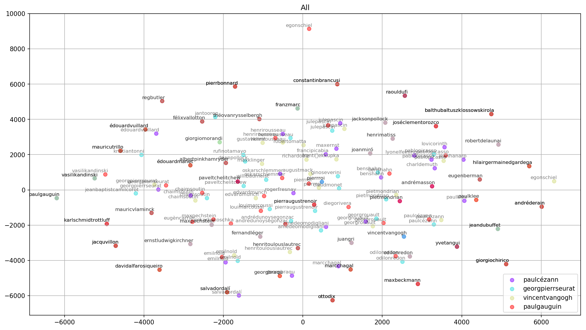

---
#  "Abusing Word2Vec, Part II"
### 2020-07-16 {#date}
### word2vec, moma, dataviz {#tags}
---

This is part two of [Can Word2Vec Describe Art-Historical Categories](/blog/2020-07-04-the-curator/)?

In the last post, I roughly described how I transformed a dataset of MoMA exhibitions into something I could feed into Word2Vec. I'm going to skip over training the model on Google Cloud for another day, and take a look at the first results and data visualizations.

With the model trained, I began by exploring the similarities between artists. 

```python
>>> model.wv.most_similar('helenfrankenthal' topn=5)

[('carlandr', 0.5939756631851196),
 ('louisnevelson', 0.5884495377540588),
 ('claeoldenburg', 0.5837007761001587),
 ('robertmotherwel', 0.576038658618927),
 ('joanmitchel', 0.5745494961738586)]
```

<Caption>
Gensim Word2Vec's method `most_similar` returns a list of tuples, `(a, b)`, where `a` is the term and `b` is the cosine similarity (score) between the two terms. Two terms will always share the same score, but in most cases will not share the same ranking (for example, Carl Andre is the top ranked artist above, but Helen Frankenthaler does not rank among Carl Andre's top five).
</Caption>

So what does it mean that two terms are similar? 

Similarity in Word2Vec refers to the cosine similarity of two vectors. Each term is a vector in 100-dimensional space, and cosine similarity is a measure of the angles between the two vectors. The function returns a value between -1 and 1, where a value of -1 means the vectors point in opposite directions, 0 means they are perpendicular, and a value of 1 means the vectors point toward the same direction. 

```
      Term       |       Similars by rank
-----------------|----------------------------------
helenfrankenthal | carlandr, louisnevelson, claeoldenburg, ...
        carlandr | frankstella, robertsmithson, robertrauschenberg, ...
   louisnevelson | allanarcangelo, helenfrankenthal, carlandr, ...
   claeoldenburg | robertrauschenberg, saulsteinberg, helenfrankenthal, ...
 robertmotherwel | willemkoon, reinhardt, larririver, ...
```

Manually typing in artist names is interesting for a minute. And the lists don't look like total nonsense. I could see these artists exhibited together. But an overview would be more helpful. For that I turned to principle component analysis and t-SNE to reduce the 100-dimensional space to 2-dimensional space.



The similars of Barbara Kruger (red) and Jackson Pollock (purple) appear to push away from each other. Looking at the cosine similarity between the two confirms that they're close to 0. This seems to agree with my intuition of their styles and the fact that I can't imagine Kruger and Pollock — or the artists they show with — would have much overlap. 


```python
>>> bk = model.wv.get_vector('barbarakruger')
>>> jp = model.wv.get_vector('jacksonpollock')
>>> model.wv.cosine_similarities(bk, [jp])

array([-0.18582422], dtype=float32)
```

<Caption>The cosine similarity between Kruger and Pollock shows their angles negatively correlated and close to 0.</Caption>



The graph above shows the similars of Cezanne, Seurat, Van Gogh and Gauguin — from MoMA's exhibition number 01 — grouped together with plenty of overlap. This also seems plausible IRL. 

The results are interesting enough to continue exploring — particularly since I'm learning more about Word2Vec, Python and data visualization. But I still don't have an idea of the error rate. I imagine it's quite high, haha. In the next post, I'll download and merge some labels into the graph and test the model's error rate.

