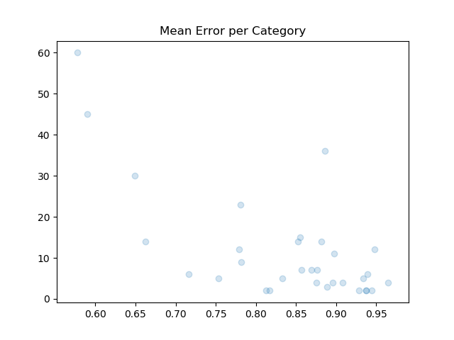
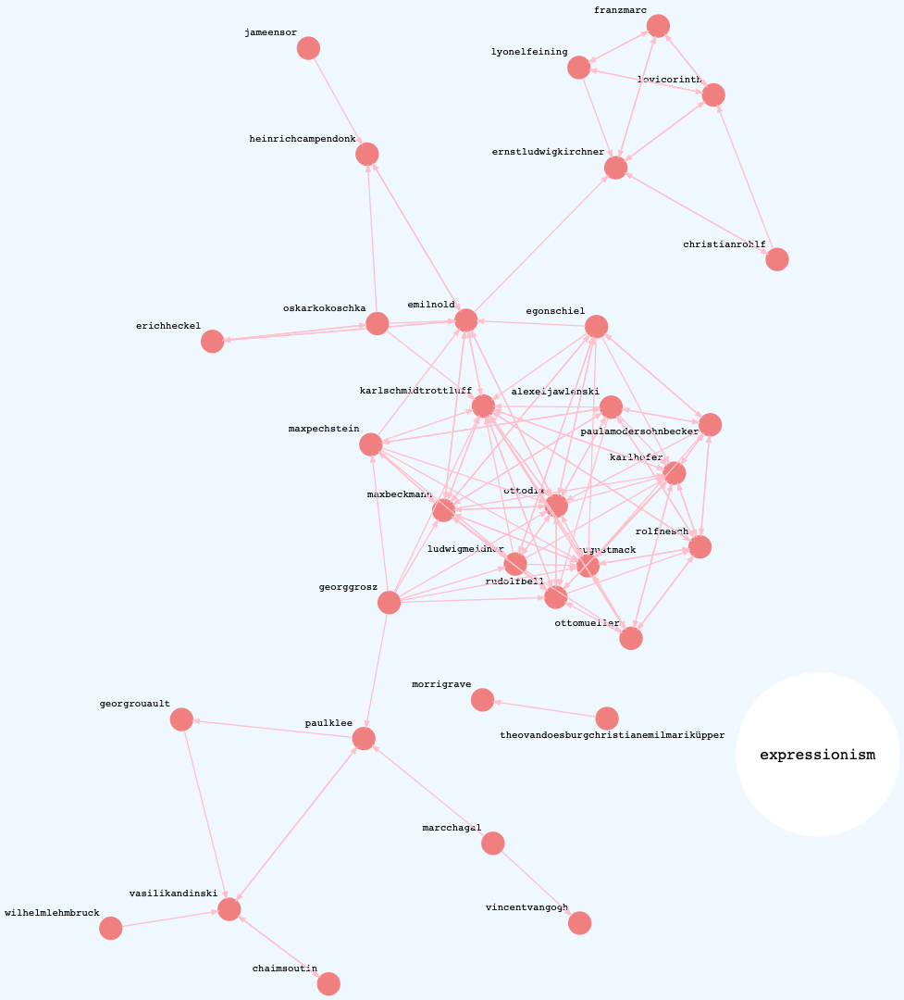
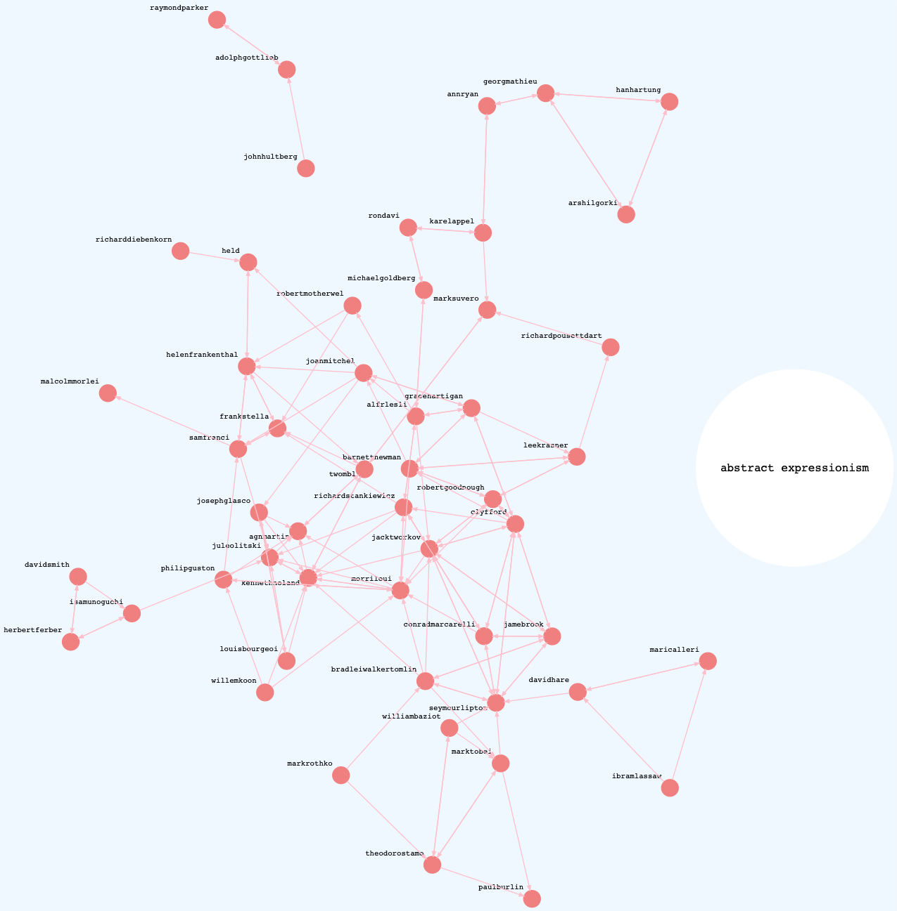

---

# "Calculating Error Rates: The Curator"

### 2020-08-02 {#date}
### word2vec, graphs, error-rates {#tags}

---

In this post, the third [of](https://lancewakeling.net/blog/2020-07-04-the-curator/) [three](https://lancewakeling.net/blog/2020-07-16-the-curator-2/) on a personal exploration of Word2Vec and the MoMA exhibition network, I conclude that the preliminary results of my experiment are promising but that a larger dataset is needed to better test its accuracy.


<Caption>
Black nodes represent exhibitions; red nodes represent artists. When selecting exhibitions of only two artists, the network topology is mostly disconnected, although some stars and squares form.
</Caption>

When I started this project it was basically a CSV inside a Pandas Dataframe inside a Jupyter Notebook. Working with Notebooks is great for experimenting with a new dataset. But, in my opinion, a successful notebook is entirely disposable, because of the many downsides of keeping code couped up in limited-access containers.

Predictably, working in notebooks quickly turned untenable. So I refactored the project into a graph with three node types: `Exhibition`, `Artist` and `Category`. Each type inherits from `class Node` to provide tokenization and book-keeping for adding/removing edges and maintaining the degree count. The [API](https://github.com/disposableraft/the-curator) is super simple:

```python
# Create three artists and an exhibition
>>> a1 = Artist('Helen Frankenthaler')
>>> a2 = Artist('John Cage')
>>> a3 = Artist('Louise Bourguois')
>>> exh = Exhibition(123, 'Three Favorites')

# Add them to the graph
>>> graph = Graph([exh])
>>> graph.add_edges(exh, [a1, a2, a3])

# Inspect the graph's properties
>>> graph.count_nodes()
4
>>> graph.count_edges()
3
>>> graph.density()
0.5

# Artist names are tokenized for free.
>>> print(a1)
{'id': 'helenfrankenthal', 'degrees': 1, 'edges': set(), 'type': 'Artist'}

# And degree counts are maintained.
>>> print(exh)
{'id': 123, 'degrees': 3, 'edges': {'johncage', 'helenfrankenthal', 'louisbourguoi'}, 'type': 'Exhibition'}
```

<Caption>
The above example shows a graph of one exhibition and three artists. The Artist node handles tokenization and maintains degree count for incoming edges.
</Caption>

The graph of exhibitions becomes the focal point of the pipeline. From there, I can fetch labels from WikiData, create new edges for artist similarity from the model, export training datasets, and analyze the results of different training parameters.

```python
# Load a version
>>> m = Main('2.0')

# Import the moma exhibition csv into a graph
>>> m.import_moma()

# Export a corpus
>>> m.export_corpus()

# Train word2vec on corpus
>>> m.train_model()

# Fetch labels (art historical movements) from Wikidata
>>> m.fetch_labels()

# Update the graph with similar artists from word2vec
>>> m.apply_similars()

# Generate a report, which includes mean error rates
>>> m.report()
```

When trained on an English corpus a Word2Vec model can be tested using similies from WordNet. It's possible to test for syntactic similarity ("read is to reading as walk is to walking")<sup>1</sup> and semantic similarity ("Berlin is to Germany as Paris is to France").

Although there's no WordNet for artist similarity, many artists exhibited at MoMA belong to one or more *movements*. By adding category nodes to the graph and connecting them to their members, we obtain a measure of similarity, which can help answer the main question of this experiment: will Word2Vec, trained on a corpus of exhibitions, group artists into art historical movements?

Conveniently, the MoMA CSV includes a `WikidataID` field, and using Sparql it's easy to get labels for some of the artist nodes.

```sql
SELECT ?movementLabel WHERE {
    wd:<Artist ID> wdt:P135 ?movement.
    SERVICE wikibase:label {
        bd:serviceParam wikibase:language "en" .
    }
}
```

<Caption>
A Sparql query to get movement labels for a given artist. See <a href="https://query.wikidata.org/">Wikidata's query service</a>.
</Caption>

In the [last post](https://lancewakeling.net/blog/2020-07-16-the-curator-2/), I went into what constitutes a similar artist. To update the graph with the model's similarity scores, the command `m.apply_similars()` loops through each node, gets its top ten most similar artists, and saves them to the graph.

That means each Artist node has ten edges. So how to test its accuracy? One way would be to measure how well, or how poorly, each *rank* performs. You could ask, across the set, how did the first prediction perform? How about the second? And so on.

The problem with ranking, however, is that it's an ordinal scale. All first-ranked scores are not comparable. This is because Artist X's first-ranked score is different from Artist Y's first-ranked score. The former could be 0.9 (really similar), while the latter could be 0.2 (not so similar). Therefore, the rank doesn't make a good scale on which to base the error rate.

Complicating things, is the fact that only 40% of the artist nodes are labeled. So, comparing ranks would also have to account for this somehow.

Instead, to calculate the error rate, I reduced the graph to the set of labeled artists and took the percentage of misses to hits and misses. This yields a ratio scale. The tradeoff is that we won't know the value of the top-ranked scores, but we will get an idea of the overall success/failure.

$$
ErrorRate = \frac{\sum{Misses}}{\sum{Hits} + \sum{Misses}}
$$

Error rates are calculated for all labeled artists together, and for all labeled artists per category. Here's a table of categories with > 10 degrees.

```txt
Category                  Mean       Variance   Degrees
-------------------------------------------------------
abstract expressionism    0.574992   0.080524   60
expressionism             0.586672   0.162307   45
abstract art              0.881388   0.021628   36
pop art                   0.646626   0.085997   30
surrealism                0.777600   0.091475   23
Post-Impressionism        0.857527   0.015125   15
Dada                      0.879370   0.027855   14
contemporary art          0.850526   0.031805   14
minimalism                0.659985   0.031520   14
Symbolism                 0.777976   0.030053   12
Cubism                    0.946533   0.008592   12
Impressionism             0.896114   0.010511   11
```

<Caption>
This table shows mean error rates per category for categories with 10 or more edges.
</Caption>

Three categories, which are well represented at MoMA and well defined art historically, have error rates around 60%. Those are Pop Art, Expressionism and Abstract Expressionism. Notice they also have degrees >= 30, while categories with fewer edges have higher mean error rates. This suggests that a larger sample of exhibitions and labeled artists would decrease the error rate.



<Caption>
The plot above shows the mean error rates (x-axis) and the degree count (y-axis) for each category. Notice the trend that categories with higher degrees also have lower mean error rates.
</Caption>

The three graphs below show directed networks of similar artists within the best performing categories. These are "success graphs" in that only the hits are rendered. Each graph shows highly connected components.

### Pop Art


### Expressionism



### Abstract Expressionism



Though the initial results are promising, it's important to keep in mind that any success merely points to describing this dataset: it doesn't generalize.

The encouraging trend above suggests that this experiment disproves the null hypothesis. Given more data (both exhibitions and labeled artists), I predict the error rate could improve.

In the future I hope to research the topologies of the various networks in this experiment. It would be interesting to know more about their transitivities, clustering, mean geodesic distances, if some similar artists form small-world networks, or if power laws apply to the exhibition-artist network.

My quirky approach essentially takes a graph, produces a corpus and runs it through a natural language model. I would also like to extend my knowledge of other models and test how, for example, a graph neural network, compares to this approach.

### Footnote

1. This example shows the ambiguity of some word embeddings, because the past tense and infinitive forms of "read" are the same.
